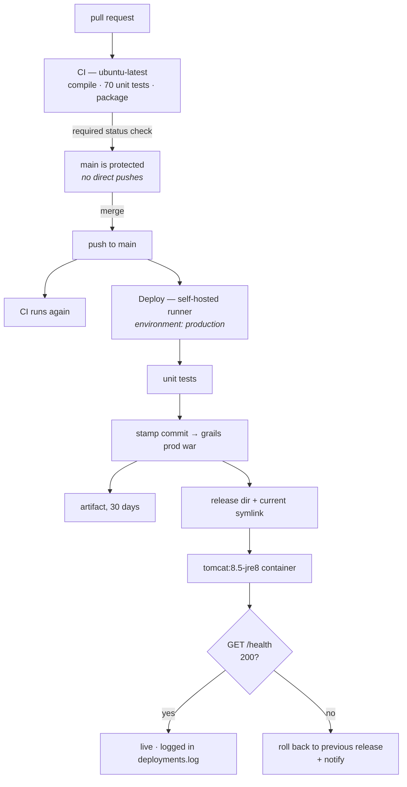

# CI/CD Pipeline

What exists, why it is shaped this way, and what is deliberately still open.

Written 2026-08-29, after closing the gaps found in a review of the
deploy-only pipeline that preceded it.

- **Repository:** `abhaijixt/grails-project` (public)
- **CI:** `.github/workflows/ci.yml` — GitHub-hosted runners
- **CD:** `.github/workflows/deploy-local.yml` — self-hosted runner on this laptop
- **Docs:** `.github/workflows/deploy-docs.yml` — unrelated MkDocs site (`DEPLOYMENT.md`)
- **Deploy target detail:** [DEPLOY-LOCAL.md](DEPLOY-LOCAL.md)

---

## 1. The pipeline



| Workflow | Trigger | Runner | Gates |
|---|---|---|---|
| **CI** | every PR to `main`, every push to `main`, manual | `ubuntu-latest` | compile, 70 unit tests, WAR packaging |
| **Deploy app (laptop)** | push to `main` (non-docs), manual | `[self-hosted, linux, grails-laptop]` | unit tests, `/health` 200, commit match |
| **Deploy docs** | push to `main` touching `docs/**` | `ubuntu-latest` | MkDocs build |

---

## 2. Security model

The repository is **public** and the deploy runner is **this laptop**. That
combination is the sharpest edge in the whole setup: a workflow that runs
fork-authored code on a self-hosted runner is arbitrary code execution on the
machine.

Making the repository private was rejected — the MkDocs site is published
through GitHub Pages at <https://abhaijixt.github.io/grails-project/>, and Pages
for a private repository requires a paid plan. Taking the docs site down to fix
a problem that has a direct mitigation is the wrong trade.

The mitigation is a hard split, enforced in three places:

| Layer | Control |
|---|---|
| Workflow design | `deploy-local.yml` is the **only** workflow targeting `self-hosted` labels, and it has **no `pull_request` trigger**. CI, which does run PR code, is on `ubuntu-latest`. |
| Repository policy | Fork-PR approval raised from `first_time_contributors` to **`all_external_contributors`** — every outside contributor's run needs manual approval, not just their first. |
| Environment | The `production` environment restricts deployments to the `main` branch and scopes `DB_PASSWORD` to it. |

Supporting hardening:

- Actions restricted to **GitHub-owned only** (`patterns_allowed: []`).
- **SHA pinning required** repo-wide; all three workflows pin every action to a
  commit SHA with the version in a trailing comment.
- `permissions: contents: read` declared explicitly in CI and deploy.
- Default workflow token permissions were already `read`.

> **If the repository ever accepts outside contributions**, revisit this. The
> current posture is safe for a solo public repo; it is not a substitute for
> moving deploys off a personal machine.

---

## 3. What was implemented

The review found fourteen gaps. Thirteen are closed; one was deliberately left
out. Priorities are from that review.

### P0 — security and data integrity

| # | Gap | What was done |
|---|---|---|
| 1 | Public repo + self-hosted runner | The three-layer split in §2. CI moved to hosted runners; fork approval tightened; deploy pinned to `main` through the `production` environment. |
| 2 | DB superuser credentials committed in a public repo | `DataSource.groovy` now contains **no credentials at all**. Two least-privilege accounts replace the `developer` superuser (below). Dev reads its password from `~/.grails/bookstore-local.groovy` (mode 600, outside the repo); production reads `DB_PASSWORD` from the environment. |
| 3 | Dev and production sharing one database | Development moved to its own database, `bookstore_db_dev`, with its own account. Production keeps `bookstore_db` and is now unreachable from the dev account. |

**Database accounts created:**

| Account | Database | Grants | Used by |
|---|---|---|---|
| `bookstore_app@localhost` | `bookstore_db` | `SELECT, INSERT, UPDATE, DELETE` | production container |
| `bookstore_dev@localhost` | `bookstore_db_dev` | `ALL PRIVILEGES` | `grails run-app` |

Production has no DDL rights, so `dbCreate` cannot reshape the production schema
even if the setting is changed by mistake. Verified:

```
$ mysql -u bookstore_app ... -e "create table probe_should_fail (id int)"
ERROR 1142 (42000): CREATE command denied to user 'bookstore_app'@'localhost'

$ mysql -u bookstore_dev ... -D bookstore_db -e "select 1"
ERROR 1044 (42000): Access denied for user 'bookstore_dev'@'localhost' to database 'bookstore_db'
```

### P1 — the missing CI half

| # | Gap | What was done |
|---|---|---|
| 4 | No `pull_request` workflow | `ci.yml` on `ubuntu-latest`: JDK 8 via `setup-java`, Grails 2.5.6 downloaded from the GitHub release and cached alongside `~/.grails` and `~/.m2/repository`, then compile → test → package. Packaging is in CI because `war` exercises GSP compilation, which `compile` and `test-app` never touch. |
| 5 | Zero test sources | **70 unit tests** across 8 specs, passing in ~7s (below). |
| 6 | `main` unprotected | Branch protection: PR required, the CI check required, branches must be up to date, linear history, conversation resolution, no force pushes, no deletions. Admin enforcement left **off** so the owner can bypass in an emergency. |

**Test suite** (`test/unit/com/learning/bookstore/`):

| Spec | Covers |
|---|---|
| `BookSpec` | price boundaries (0.01 / 9999.99), title length, negative stock, ISBN uniqueness, required category |
| `AuthorSpec` | email format and uniqueness, bio bounds, `fullName` |
| `CustomerSpec` | phone regex accept/reject cases, `ACTIVE` default, `fullName` |
| `BookServiceSpec` | create/update/delete paths, duplicate ISBN, unknown category, author attachment, delete blocked by order items, low-stock threshold, page-size cap, DTO shape |
| `OrderServiceSpec` | stock decrement and total, insufficient stock, inactive customer, all 11 status transitions, `shippedAt` stamping, cancel restoring stock |
| `BookControllerSpec` | 200/201/400/404 responses with a mocked service |
| `ApiResponseServiceSpec` | success/error envelope shape |
| `HealthControllerSpec` | UP with a real H2 datasource, DOWN/503 on a failing one, build metadata present |

### P2 — release robustness

| # | Gap | What was done |
|---|---|---|
| 8 | WAR never archived | Both CI and deploy upload the WAR with `actions/upload-artifact` (30-day retention); CI also uploads test reports (14 days). Rollback no longer depends solely on `~/deploys` surviving. |
| 9 | No `production` environment | Created, with a deployment branch policy restricting it to `main`, and `DB_PASSWORD` scoped to it. Every deploy now appears in the repository's Deployments timeline. |
| 10 | No versioning | `scripts/stamp-build-metadata.sh` writes `app.commit`, `app.build` and `app.builtAt` into `application.properties` before packaging. Grails reads them into `grails.util.Metadata`, `/health` reports them, and the deploy script compares the commit `/health` returns against the one it deployed — catching a container that failed to be replaced. Each release directory also gets a `RELEASE` file (commit, run URL, WAR sha256) and each deploy appends to `deployments.log`. |

### P3 — operations

| # | Gap | What was done |
|---|---|---|
| 11 | Container logs destroyed on every deploy | `~/deploys/grails-bookstore/logs` is mounted at `/usr/local/tomcat/logs`. `Config.groovy` gained a rolling file appender (10MB × 10) writing `grails-bookstore.log` there, plus a console appender for `docker logs`. |
| 12 | Health check was a business endpoint | New `HealthController` at `/health` and `/api/v1/health`: probes the database with `SELECT 1`, returns 200/`UP` or 503/`DOWN` with latency, and reports version, commit, build and environment. The deploy gate now uses it, so "healthy" no longer depends on whether any books exist. |
| 13 | No failure notification | `scripts/notify-failure.sh` runs on job failure: appends to `deploy-failures.log` and raises a `notify-send` desktop notification, pointing `DBUS_SESSION_BUS_ADDRESS` at the login session's bus (the runner is a systemd service without one of its own). It exits 0 so a notification problem never masks the real failure. |
| 14 | Actions permissions wide open | See §2 — GitHub-owned actions only, SHA pinning required, all workflows pinned. |

### Repository settings applied

| Setting | Before | After |
|---|---|---|
| Fork-PR approval | `first_time_contributors` | `all_external_contributors` |
| `allowed_actions` | `all` | `selected` (GitHub-owned only) |
| `sha_pinning_required` | `false` | `true` |
| Branch protection on `main` | none | PR + required CI check + linear history |
| Environments | `github-pages` only | `github-pages`, `production` (branch-restricted to `main`) |
| Secrets | none | `DB_PASSWORD` (production environment) |
| Variables | none | `DB_USER=bookstore_app` |

---

## 4. Verification performed

Everything below was run on this machine, not inferred.

| Check | Result |
|---|---|
| `grails --non-interactive test-app unit:` | 70 tests, 0 failed, 7s |
| `grails --non-interactive prod war` | WAR built on JDK 8 / Grails 2.5.6 |
| `scripts/deploy-local.sh` end to end | container started, `/health` 200 in ~11s |
| `GET /health` (deployed) | `status: UP`, `database: UP`, commit matches the deployed SHA |
| `GET /api/v1/books` (deployed) | 200 — the existing API still works through `bookstore_app` |
| `grails run-app` (development) | starts, `/health` reports `environment: development`, schema created in `bookstore_db_dev` |
| Production DDL attempt | denied (`ERROR 1142`) |
| Dev account reaching production DB | denied (`ERROR 1044`) |
| Log volume | Tomcat and app logs present on the host after a redeploy |

**Not verified:** `ci.yml` has never executed — it needs a push to GitHub. Its
risk is dependency resolution from `repo.grails.org` on a hosted runner, which
cannot be tested locally. The same build steps do pass here.

---

## 5. Deliberately not implemented

### Schema migrations (gap #7) — excluded by request

There is still no migration tool. Production is `dbCreate = "none"` with a
DML-only account, so a domain-class change reaches the code but never the
schema, and the app will fail at runtime on the missing column. The usual answer
for this stack is the Grails 2 `database-migration` plugin (Liquibase).

Until then, schema changes have to be applied by hand with an admin account
before the deploy that needs them.

### Related open item: the orphaned legacy tables

`bookstore_db` contains two parallel schemas:

| Grails tables (live, empty) | Legacy tables (data, unused) |
|---|---|
| `book` (0) | `books` (62) |
| `author` (0) | `authors` (59) |
| `category` (0) | `categories` (23) |
| `customer` (0) | `customers` (130) |

The legacy tables were created 2026-03-15, predate the Grails app, and use a
different convention (`created_at` vs `date_created`, no `version` column, no
`publisher`, `decimal(10,2)` vs `decimal(6,2)`). Neither the Grails 6 nor the
Grails 2.5.6 domain classes have ever mapped to them.

So the deployed app is healthy and serving an empty dataset. Closing this is a
data-migration decision — backfill the Grails tables, or map the domains onto
the legacy ones — and belongs with the migration tooling above.

### Credential rotation — done 2026-08-29

The `developer` MariaDB password has been rotated. Verified: the old value is
rejected (`ERROR 1045`), and both application accounts and the running deploy
are unaffected, because the app no longer uses `developer` at all.

```
$ mysql -u developer -p<old> -e "select 1"
ERROR 1045 (28000): Access denied for user 'developer'@'localhost'
```

The old value remains in git history on a public repository, but it is now inert
— it grants nothing. Rewriting history to remove it is optional and would
require a force push, which branch protection now blocks.

**Documentation synced 2026-08-29.** The published design docs had drifted since
the Grails 6 → 2.5.6 downgrade — they described a Gradle build, an
`application.yml`, and a `Spring Boot` runtime that the downgrade removed, plus
the old shared database and credential. Rewritten against the current code:

| File | Change |
|---|---|
| `docs/walkthrough/configuration.md` | Rewritten for `application.properties`, `BuildConfig.groovy`, `DataSource.groovy`, `Config.groovy`; documents the dev/prod database split and the `/health` route |
| `docs/walkthrough/entry-point.md` | `Application.groovy` (which does not exist in Grails 2) replaced with `BootStrap.groovy` and `web-app/WEB-INF`; adds `HealthController` |
| `docs/walkthrough/index.md` | Reading order and page table renumbered |
| `docs/index.md` | Stack summary and run instructions (JDK 8, `grails run-app`, context paths) |
| `docs/HLD.md` | §2 stack, §9 environment matrix, §10 file structure, §11 characteristics |

`mkdocs build --strict` passes. No credential remains in any published page.

**Left alone:** `docs/CODE_WALKTHROUGH.md` and `knowledge-base/**`. The former is
listed under `exclude_docs` in `mkdocs.yml` and 404s on the live site — a
superseded monolith replaced by `docs/walkthrough/`; the latter are dated
snapshots, historical by design. Both still describe the Grails 6 layout. Deleting
`docs/CODE_WALKTHROUGH.md` would be reasonable, but it is not this work's call.

## 6. File inventory

| Path | Purpose |
|---|---|
| `.github/workflows/ci.yml` | Compile, test, package on hosted runners |
| `.github/workflows/deploy-local.yml` | Build and deploy on the laptop |
| `.github/workflows/deploy-docs.yml` | MkDocs site (pre-existing; actions pinned) |
| `scripts/setup-self-hosted-runner.sh` | One-time runner install and registration |
| `scripts/deploy-local.sh` | Release staging, container lifecycle, health gate, rollback |
| `scripts/stamp-build-metadata.sh` | Writes commit/build/timestamp into `application.properties` |
| `scripts/notify-failure.sh` | Failure log + desktop notification |
| `grails-app/controllers/.../HealthController.groovy` | `/health` probe |
| `test/unit/com/learning/bookstore/*.groovy` | 70 unit tests |
| `~/.grails/bookstore-local.groovy` | Dev DB password (not in the repo) |
| `~/.config/bookstore/*-db-password` | Generated account passwords (mode 600) |
