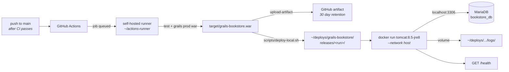

# App Deployment — This Laptop, via GitHub Actions

The Grails app is built and deployed **on this machine** by a GitHub Actions
workflow running on a self-hosted runner. GitHub hosts the trigger and the logs;
every command runs here.

This document covers the deployment target — the runner, the container, releases
and rollback. For the pipeline as a whole (CI, branch protection, the security
model, repository settings) see **[CICD.md](CICD.md)**.

- **Workflow:** `.github/workflows/deploy-local.yml`
- **Deploy script:** `scripts/deploy-local.sh`
- **Runner installer:** `scripts/setup-self-hosted-runner.sh`
- **Health probe:** <http://localhost:8080/health>

> This is the *application* pipeline. The MkDocs site has its own, unrelated
> one — see `DEPLOYMENT.md`.

---

## Why a self-hosted runner

GitHub's hosted runners are throwaway cloud VMs; nothing they build can reach
this laptop. A self-hosted runner is the supported way to have a workflow act on
your own machine: it polls GitHub for jobs and executes them locally, so no
inbound port or tunnel is needed.

It also happens to be the only practical option for the deploy job. The build
needs **JDK 8 and Grails 2.5.6**, both already installed via SDKMAN.

> **Security:** `deploy-local.yml` is the only workflow allowed to target the
> self-hosted runner, and it has no `pull_request` trigger. CI runs on
> GitHub-hosted runners instead. The reasoning is in [CICD.md](CICD.md#security-model).

---

## Architecture



| Piece | Choice | Why |
|---|---|---|
| Build toolchain | SDKMAN JDK 8 + Grails 2.5.6 | Groovy 2.4 cannot run on the system JDK 26; the workflow pins `JAVA_HOME` and fails fast if it isn't 1.8 |
| Runtime | `tomcat:8.5-jre8` container | Nothing new installed on the host, and `--restart unless-stopped` brings the app back after a reboot |
| Networking | `--network host` | `bookstore_app` is granted on `'localhost'` only, so the container must connect as a local client |
| Releases | `releases/<id>/ROOT.war` + `current` symlink | A failed health check can restart the previous WAR without rebuilding it |
| Health gate | `GET /health` → 200 | Reports process *and* database state without depending on business data |
| Logs | Host volume at `~/deploys/grails-bookstore/logs` | `docker rm -f` runs on every deploy and would otherwise take the logs with it |

---

## One-time setup

### 1. Register the runner

Get a registration token from
**Settings → Actions → Runners → New self-hosted runner**
(`https://github.com/abhaijixt/grails-project/settings/actions/runners/new`) —
it expires after an hour. Then:

```bash
./scripts/setup-self-hosted-runner.sh <registration-token>
```

The script checks the prerequisites (docker, the SDKMAN candidates), downloads
the runner into `~/actions-runner`, registers it with the label
**`grails-laptop`**, and installs it as a systemd service so it survives a
reboot. Re-run it with a fresh token to re-register.

### 2. Database credentials — already configured

`DB_PASSWORD` is set as a **`production` environment secret** holding the
password for the `bookstore_app` MariaDB account. The plaintext lives at
`~/.config/bookstore/prod-db-password` (mode 600) on this machine only.

`grails-app/conf/DataSource.groovy` reads it from the environment in production
and has no default; the deploy script refuses to run without it rather than
swapping a working release for one that 500s on every query.

To rotate it:

```bash
NEW=$(openssl rand -base64 24 | tr -d '/+=' | head -c 28)
mysql -u <admin> -p -e "ALTER USER 'bookstore_app'@'localhost' IDENTIFIED BY '${NEW}'"
printf '%s' "$NEW" > ~/.config/bookstore/prod-db-password
gh secret set DB_PASSWORD --repo abhaijixt/grails-project --env production \
  --body "$(cat ~/.config/bookstore/prod-db-password)"
```

Repository *variables* override the rest:

| Variable | Default | Set? |
|---|---|---|
| `DB_URL` | `jdbc:mariadb://127.0.0.1:3306/bookstore_db?useSSL=false` | no (default used) |
| `DB_USER` | `bookstore_app` | yes |
| `JAVA8_HOME` | `~/.sdkman/candidates/java/current` | no (default used) |
| `GRAILS_2_HOME` | `~/.sdkman/candidates/grails/current` | no (default used) |

### 3. Schema

Production runs with `dbCreate = "none"` and `bookstore_app` holds DML
privileges only — no `CREATE`, `ALTER` or `DROP`. Grails cannot reshape the
production schema even if that setting is changed by accident, so schema changes
have to be applied deliberately.

Development uses a **separate database**, `bookstore_db_dev`, owned by the
`bookstore_dev` account. It is the only environment with `dbCreate = "update"`.

---

## Running a deploy

**Automatically:** merge a PR to `main`. Docs-only changes are filtered out.

**Manually:** Actions → *Deploy app (laptop)* → **Run workflow**.

The job runs the unit tests, packages the WAR, uploads it as an artifact, stages
it as a new release, recreates the container, then polls `/health` for up to 150
seconds. Roughly 2–4 minutes.

A `deploy-local` concurrency group with `cancel-in-progress: false` serialises
runs — two deploys racing would fight over the container name and the `current`
symlink.

Every run is recorded in the repository's **Deployments** timeline via the
`production` environment, which also restricts deploys to `main`.

---

## What a deploy does on disk

```
~/deploys/grails-bookstore/
├── current -> releases/r7-9f3c1ab…      # symlink to the live release
├── deployments.log                      # append-only: when, which release, which commit
├── deploy-failures.log                  # written by scripts/notify-failure.sh
├── logs/                                # Tomcat + app logs, mounted into the container
│   ├── catalina.<date>.log
│   └── grails-bookstore.log             # rolling, 10MB x 10
└── releases/
    ├── r7-9f3c1ab…/
    │   ├── ROOT.war
    │   └── RELEASE                      # commit, run URL, WAR sha256, deployed_at
    └── r6-2d9b737…/                     # kept for rollback
```

The five most recent releases are kept (`KEEP_RELEASES`); older ones are pruned.

If the health check fails, the script dumps the last 100 container log lines,
re-points `current` at the previous release, restarts it, and exits non-zero —
so a bad build leaves the last good WAR serving traffic. `scripts/notify-failure.sh`
then records the failure and raises a desktop notification if a session is available.

After a successful check the script compares the commit reported by `/health`
against the one being deployed, so a container that failed to be replaced is
caught rather than passing silently.

---

## Operating notes

```bash
# Is it up, and what is it running?
curl -s http://localhost:8080/health

# Which release is live
cat ~/deploys/grails-bookstore/current/RELEASE

# Deploy history
cat ~/deploys/grails-bookstore/deployments.log

# Logs (survive redeploys)
tail -f ~/deploys/grails-bookstore/logs/grails-bookstore.log
docker logs -f grails-bookstore

# Stop / start without a redeploy
docker stop grails-bookstore
docker start grails-bookstore

# Take it down for good (it will not come back after a reboot)
docker rm -f grails-bookstore

# Roll back by hand
ln -sfn ~/deploys/grails-bookstore/releases/<older-id> ~/deploys/grails-bookstore/current
WAR_PATH=~/deploys/grails-bookstore/current/ROOT.war \
  DB_PASSWORD=$(cat ~/.config/bookstore/prod-db-password) ./scripts/deploy-local.sh

# Runner service
sudo ~/actions-runner/svc.sh status
```

### Deploying without GitHub

The workflow is a thin wrapper — the same deploy runs standalone:

```bash
export JAVA_HOME=~/.sdkman/candidates/java/current
export PATH="$JAVA_HOME/bin:$HOME/.sdkman/candidates/grails/current/bin:$PATH"
./scripts/stamp-build-metadata.sh
grails --non-interactive prod war target/grails-bookstore.war
WAR_PATH=$PWD/target/grails-bookstore.war \
  DB_PASSWORD=$(cat ~/.config/bookstore/prod-db-password) ./scripts/deploy-local.sh
```

`stamp-build-metadata.sh` leaves `application.properties` modified. CI checkouts
are clean so it never gets committed; locally, `git checkout -- application.properties`
tidies up.

### Gotchas

- **The laptop must be awake and online.** A self-hosted runner only picks up
  jobs while it is running; a push made while the machine is asleep is executed
  when it wakes, not skipped.
- **Port 8080 is fixed.** With `--network host` the port comes from the image's
  `server.xml`. To use another port, set `USE_HOST_NETWORK=0` — but then the
  container reaches MariaDB over the Docker bridge, which needs a grant for
  `bookstore_app` from the bridge subnet and a `DB_URL` pointing at
  `host.docker.internal`.
- **The dev app runs under a context path.** `grails run-app` serves
  `http://localhost:8080/grails-bookstore/health`; the deployed WAR is `ROOT.war`
  and serves `http://localhost:8080/health`.
- **Log files are owned by root.** The container's Tomcat runs as root, so files
  under `logs/` are root-owned on the host. Reading them is fine; deleting them
  needs `sudo`.
