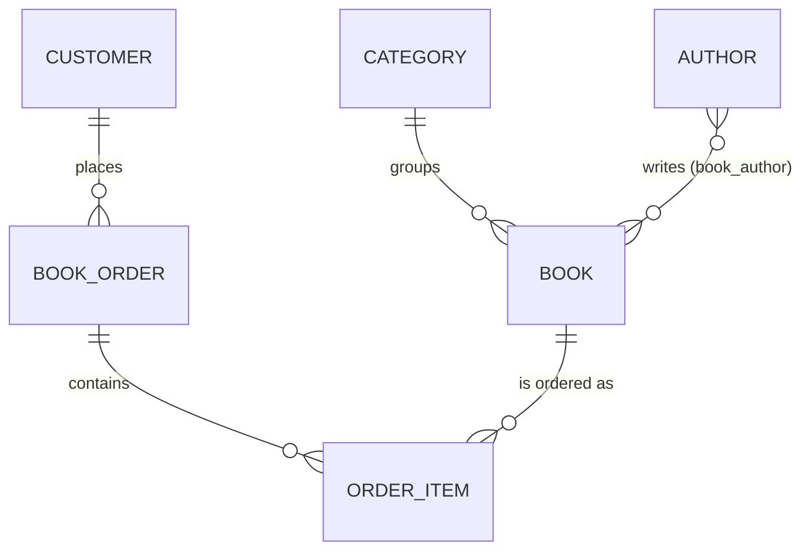
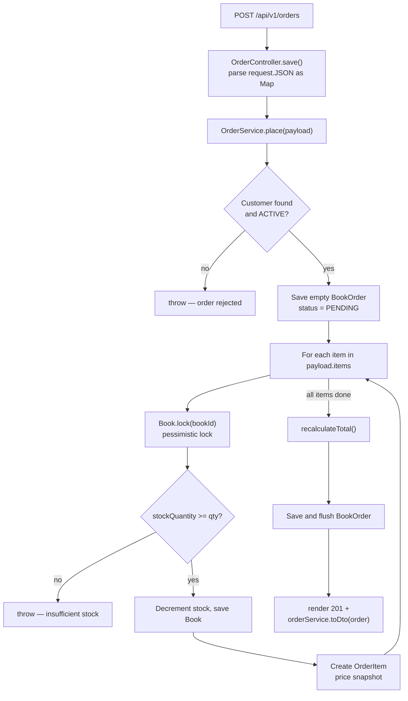

# High-Level Design — Grails Bookstore

---

## 1. Purpose

A RESTful back-end API for a bookstore. Clients (browser, mobile app, Postman) call JSON endpoints to manage books, authors, categories, customers, and orders. There is no front-end — all responses are JSON.

---

## 2. Technology Stack

| Layer | Technology | Version |
|---|---|---|
| Language | Apache Groovy | 2.4.x (managed by Grails) |
| Framework | Grails | 2.5.6 |
| Runtime | Servlet container (no embedded runtime) | Servlet 3.0 |
| ORM | GORM + Hibernate | 3.x / 3.6.10 |
| Database (dev/prod) | MariaDB | 10.x |
| Database (test) | H2 in-memory | 1.3.176 |
| JDBC driver | MariaDB Java client | 1.5.9 (JDBC 4.1) |
| Build | `grails` CLI + Ivy | 2.5.6 |
| JVM | OpenJDK | 8 |
| Packaging | WAR | — |
| Deployment runtime | Tomcat (container image) | 8.5 / JRE 8 |

**The JDK 8 pin is load-bearing.** Groovy 2.4 cannot emit or run bytecode above
1.8 and will not start on a newer JVM, so every build path asserts the Java
version before invoking `grails`.

---

## 3. System Context

```
┌─────────────────────────────────────────────────────┐
│                   External Clients                   │
│   (Browser / Mobile App / Postman / Frontend SPA)   │
└──────────────────────┬──────────────────────────────┘
                       │  HTTP/JSON  (port 8080)
                       ▼
┌─────────────────────────────────────────────────────┐
│              Grails Bookstore API                    │
│                                                     │
│  ┌───────────┐  ┌──────────┐  ┌──────────────────┐  │
│  │Controllers│→ │ Services │→ │  GORM / Hibernate│  │
│  └───────────┘  └──────────┘  └────────┬─────────┘  │
└────────────────────────────────────────┼────────────┘
                                         │  JDBC
                                         ▼
                             ┌───────────────────────┐
                             │   MariaDB / H2 (test) │
                             │   bookstore_db         │
                             └───────────────────────┘
```

---

## 4. Architectural Pattern

The application follows the **layered architecture** prescribed by Grails:

```
Request
  │
  ▼
┌────────────────────────────────────────────┐
│  Controller Layer  (HTTP in / HTTP out)     │
│  Parses request, calls service, renders JSON│
└────────────────┬───────────────────────────┘
                 │
                 ▼
┌────────────────────────────────────────────┐
│  Service Layer  (Business Logic)            │
│  Transactions, validation, orchestration   │
└────────────────┬───────────────────────────┘
                 │
                 ▼
┌────────────────────────────────────────────┐
│  Domain Layer  (Data + Rules)               │
│  GORM domain classes, constraints, state   │
└────────────────┬───────────────────────────┘
                 │
                 ▼
┌────────────────────────────────────────────┐
│  Database  (MariaDB / H2)                  │
│  Managed by Hibernate DDL (update mode)    │
└────────────────────────────────────────────┘
```

Each layer has one responsibility:
- **Controller** — translate HTTP ↔ application objects, no business logic
- **Service** — all business rules, all transactions
- **Domain** — data shape, relationships, constraints, state machines

---

## 5. Domain Model (Entity Relationship Overview)

```
Category ──< Book >── Author
              │
              │ (via OrderItem)
              ▼
Customer ──< BookOrder >── OrderItem ──> Book
```

!!! note "Rendered equivalent"

    The same entity relationships as a Mermaid ER diagram. The ASCII sketch above is the original; this is a rendered version of it, with the join table between `Book` and `Author` shown as a many-to-many relationship.



Six persistent entities:

| Entity | Responsibility |
|---|---|
| `Category` | Groups books into genres/sections |
| `Author` | Person who wrote one or more books |
| `Book` | The product — has a category, zero or more authors, stock quantity |
| `Customer` | Buyer — has an active/inactive/suspended status |
| `BookOrder` | A purchase placed by a customer; progresses through a status lifecycle |
| `OrderItem` | One line on an order — which book, how many, price at the time of purchase |

Two enums:

| Enum | Values |
|---|---|
| `OrderStatus` | `PENDING → CONFIRMED → PROCESSING → SHIPPED → DELIVERED → REFUNDED` (+ `CANCELLED`) |
| `CustomerStatus` | `ACTIVE`, `INACTIVE`, `SUSPENDED` |

---

## 6. API Surface

All endpoints are under `/api/v1/`. All responses are JSON with this envelope:

```json
{
  "success": true,
  "message": "Books retrieved",
  "data": { ... },
  "timestamp": "2026-05-11T10:30:00.000Z"
}
```

### Books

| Method | URL | Description |
|---|---|---|
| GET | `/api/v1/books` | Paginated list (page, size, sortBy, sortDir) |
| POST | `/api/v1/books` | Create a book |
| GET | `/api/v1/books/{id}` | Get book by ID |
| PUT | `/api/v1/books/{id}` | Update book |
| DELETE | `/api/v1/books/{id}` | Delete book (blocked if has orders) |
| GET | `/api/v1/books/search` | Filter by title, categoryId, minPrice, maxPrice, inStock |
| GET | `/api/v1/books/isbn/{isbn}` | Lookup by ISBN |
| GET | `/api/v1/books/low-stock` | Books below stock threshold |

### Authors

| Method | URL | Description |
|---|---|---|
| GET | `/api/v1/authors` | List all authors |
| POST | `/api/v1/authors` | Create author |
| GET | `/api/v1/authors/{id}` | Get author by ID |
| PUT | `/api/v1/authors/{id}` | Update author |
| DELETE | `/api/v1/authors/{id}` | Delete author |

### Categories

| Method | URL | Description |
|---|---|---|
| GET | `/api/v1/categories` | List all categories (with book count) |
| POST | `/api/v1/categories` | Create category |
| GET | `/api/v1/categories/{id}` | Get category by ID |
| PUT | `/api/v1/categories/{id}` | Update category |
| DELETE | `/api/v1/categories/{id}` | Delete (blocked if has books) |

### Orders

| Method | URL | Description |
|---|---|---|
| POST | `/api/v1/orders` | Place a new order |
| GET | `/api/v1/orders/{id}` | Get order by ID |
| GET | `/api/v1/orders/customer/{customerId}` | Paginated orders for a customer |
| GET | `/api/v1/orders/status/{status}` | Paginated orders by status |
| PATCH | `/api/v1/orders/{id}/status?newStatus=` | Advance order status |
| POST | `/api/v1/orders/{id}/cancel` | Cancel order (refunds stock) |

---

## 7. Key Business Rules

1. **Stock management** — when an order is placed, each book's `stockQuantity` is decremented. When an order is cancelled, stock is restored. A pessimistic database lock (`Book.lock(id)`) prevents two simultaneous orders from overselling the same book.

2. **Order state machine** — an order can only move between statuses in a defined sequence. The `OrderStatus` enum enforces valid transitions via `canTransitionTo()`. Invalid transitions throw an error.

3. **Order cancellation** — only orders in `PENDING` or `CONFIRMED` state can be cancelled. The service appends the cancellation reason to the order's notes field.

4. **Customer gate** — orders can only be placed for `ACTIVE` customers. `INACTIVE` or `SUSPENDED` customers are rejected at order placement.

5. **Referential integrity** — a `Category` cannot be deleted if it has books. A `Book` cannot be deleted if it has associated `OrderItem` records. These are enforced in the service layer before the database is touched.

6. **Price snapshot** — `OrderItem.priceAtPurchase` records the book's price at the moment of purchase. Future price changes on the `Book` do not alter historical order totals.

7. **ISBN uniqueness** — ISBNs are unique across the catalogue. The service checks for duplicates before create and before update (excluding the current book's own ISBN on updates).

---

## 8. Data Flow — Placing an Order

```
POST /api/v1/orders
        │
        ▼
OrderController.save()
  Parse request.JSON as Map
        │
        ▼
OrderService.place(payload)
  1. Get Customer — throw if not found or not ACTIVE
  2. Save empty BookOrder (PENDING status)
  3. For each item in payload.items:
       a. Book.lock(bookId)          ← pessimistic lock
       b. Check stockQuantity >= qty ← throw if insufficient
       c. Decrement stock, save Book
       d. Create OrderItem (price snapshot)
  4. recalculateTotal() on the order
  5. Save & flush BookOrder
        │
        ▼
OrderController
  render 201 + orderService.toDto(order)
```

!!! note "Rendered equivalent"

    The same order-placement flow as a Mermaid diagram. The ASCII trace above is the original; this is a rendered version of it.



---

## 9. Configuration Environments

| Environment | Database | DDL Strategy | Account | Password source |
|---|---|---|---|---|
| `development` | MariaDB `localhost:3306/bookstore_db_dev` | `update` | `bookstore_dev` (all privileges on that database) | `DEV_DB_PASSWORD`, or `~/.grails/bookstore-local.groovy` |
| `test` | H2 in-memory | `create-drop` | `sa` | none needed |
| `production` | MariaDB `localhost:3306/bookstore_db` | `none` | `bookstore_app` (DML only) | `DB_PASSWORD` from the deploy environment |

**Development and production are separate databases.** They shared
`bookstore_db` until 2026-08-29, which meant development's `dbCreate = "update"`
could rewrite production's schema whenever a domain class changed.

**No credentials live in the repository.** `DataSource.groovy` reads every
password from the environment or from an external config file outside the
project tree.

`dbCreate: none` in production means Hibernate will not auto-alter the schema,
and the `bookstore_app` account holds no `CREATE`, `ALTER` or `DROP` rights, so
it could not do so even if the setting changed. Schema changes must be applied
deliberately before the deploy that needs them — there is currently no migration
tooling in the project.

---

## 10. Project File Structure

```
grails-bookstore/
├── docs/                        ← Design documents (HLD, LLD, Code Walkthrough)
├── application.properties       ← Grails version, app name, build stamp
├── CICD.md                      ← Pipeline: CI, deploy, security model
├── DEPLOY-LOCAL.md              ← Deployment target detail
├── .github/workflows/
│   ├── ci.yml                   ← Compile, test, package (hosted runners)
│   ├── deploy-local.yml         ← Build and deploy (self-hosted runner)
│   └── deploy-docs.yml          ← This documentation site
├── scripts/
│   ├── deploy-local.sh          ← Releases, container lifecycle, health gate
│   ├── stamp-build-metadata.sh  ← Commit/build stamp into application.properties
│   ├── notify-failure.sh        ← Failure log + desktop notification
│   └── setup-self-hosted-runner.sh
├── web-app/WEB-INF/             ← applicationContext.xml, sitemesh.xml
├── test/unit/com/learning/bookstore/
│   └── *Spec.groovy             ← 70 unit tests
└── grails-app/
    ├── conf/
    │   ├── BuildConfig.groovy   ← Dependencies, plugins, JVM targets
    │   ├── DataSource.groovy    ← DB config per environment (no credentials)
    │   ├── Config.groovy        ← App config, external config, log4j
    │   ├── BootStrap.groovy     ← Lifecycle hooks
    │   └── UrlMappings.groovy   ← All REST routes
    ├── domain/com/learning/bookstore/
    │   ├── Book.groovy
    │   ├── Author.groovy
    │   ├── Category.groovy
    │   ├── Customer.groovy
    │   ├── BookOrder.groovy
    │   ├── OrderItem.groovy
    │   ├── OrderStatus.groovy   ← Enum with state machine
    │   └── CustomerStatus.groovy
    ├── services/com/learning/bookstore/
    │   ├── BookService.groovy
    │   ├── OrderService.groovy
    │   ├── AuthorService.groovy
    │   └── ApiResponseService.groovy
    └── controllers/com/learning/bookstore/
        ├── BookController.groovy
        ├── AuthorController.groovy
        ├── CategoryController.groovy
        ├── OrderController.groovy
        └── HealthController.groovy  ← /health probe, used as the deploy gate
```

There is no `Application.groovy` and no Gradle build: Grails 2 packages a plain
WAR that a servlet container starts.

---

## 11. Non-Functional Characteristics

| Concern | Current State |
|---|---|
| Authentication | None — all endpoints are public |
| Pagination | Page size capped at 100 on all list endpoints |
| Concurrency | Pessimistic locking on stock decrement |
| Error format | Consistent JSON envelope on all error responses |
| Validation | GORM constraints enforced at save; business rules in services |
| Logging | log4j 1.x via the Grails `Config.groovy` DSL; console plus a rolling file appender on a host volume that survives redeploys |
| API versioning | All routes prefixed `/api/v1/` |
| Health | `GET /health` reports process, database and build state (200/`UP`, 503/`DOWN`) |
| Tests | 70 unit specs covering domain constraints, service logic and controller responses |
| CI/CD | PRs gated on compile + tests; merges to `main` deploy automatically (see `CICD.md`) |
