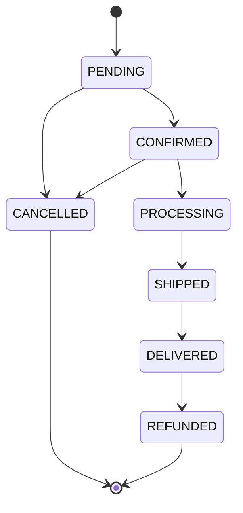
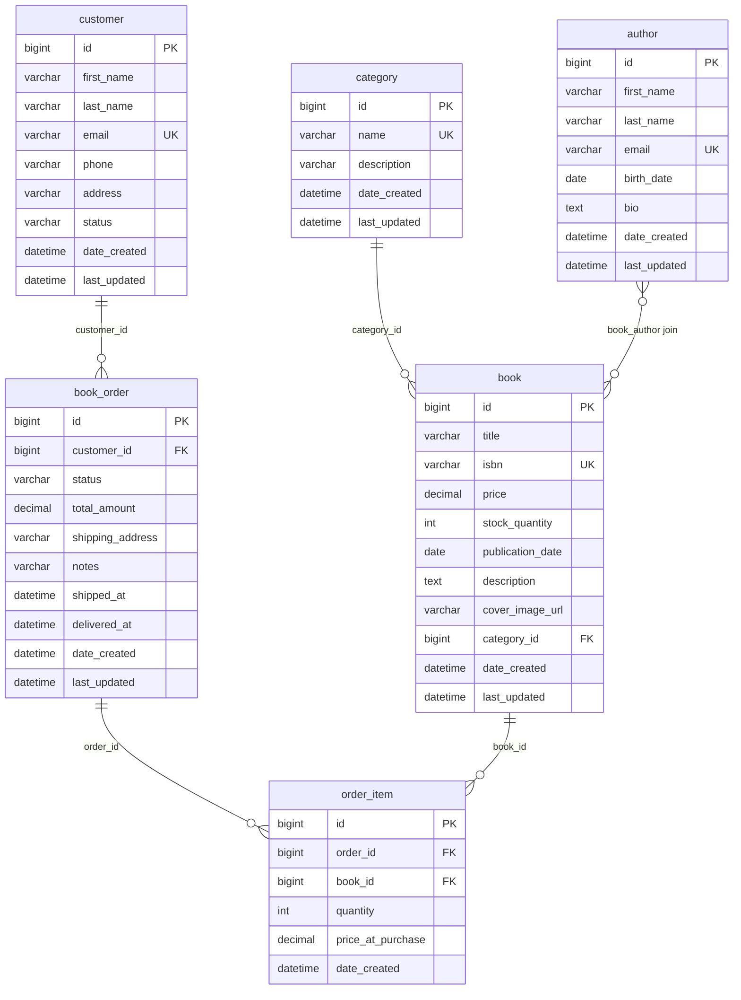

# Low-Level Design — Grails Bookstore

---

## 1. Domain Class Specifications

### 1.1 `Book`

**File:** `grails-app/domain/com/learning/bookstore/Book.groovy`

| Field | Type | Nullable | Constraints |
|---|---|---|---|
| `id` | `Long` | No | Auto-generated by GORM |
| `title` | `String` | No | 1–300 characters |
| `isbn` | `String` | No | Unique, max 20 characters |
| `price` | `BigDecimal` | No | 0.01–9999.99 |
| `stockQuantity` | `Integer` | No | min 0 |
| `publicationDate` | `Date` | Yes | — |
| `description` | `String` | Yes | max 2000 chars; mapped as SQL TEXT column |
| `coverImageUrl` | `String` | Yes | max 500 characters |
| `publisher` | `String` | Yes | max 200 characters |
| `dateCreated` | `Date` | — | Auto-managed by GORM on insert |
| `lastUpdated` | `Date` | — | Auto-managed by GORM on update |

**Relationships:**

```
Book  --belongsTo-->  Category     (many books to one category; FK: category_id)
Book  --hasMany-->    Author       (join table: book_author)
Book  --hasMany-->    OrderItem    (one book can appear in many order items)
```

**GORM mapping note:** `description` is mapped with `type: "text"` so MariaDB stores it as a `TEXT` column rather than `VARCHAR`.

---

### 1.2 `Author`

**File:** `grails-app/domain/com/learning/bookstore/Author.groovy`

| Field | Type | Nullable | Constraints |
|---|---|---|---|
| `id` | `Long` | No | Auto-generated |
| `firstName` | `String` | No | max 100 |
| `lastName` | `String` | No | max 100 |
| `email` | `String` | No | Unique, email format validated |
| `birthDate` | `Date` | Yes | — |
| `bio` | `String` | Yes | max 1000 characters |
| `dateCreated` | `Date` | — | Auto-managed |
| `lastUpdated` | `Date` | — | Auto-managed |

**Computed property:**

```groovy
String getFullName() { "${firstName} ${lastName}" }
// Called as author.fullName anywhere in the codebase
```

**Relationship:** `hasMany = [books: Book]` — the join table is owned by the `Book` side.

---

### 1.3 `Category`

**File:** `grails-app/domain/com/learning/bookstore/Category.groovy`

| Field | Type | Nullable | Constraints |
|---|---|---|---|
| `id` | `Long` | No | Auto-generated |
| `name` | `String` | No | Unique, 2–100 characters |
| `description` | `String` | Yes | max 500 characters |
| `dateCreated` | `Date` | — | Auto-managed |
| `lastUpdated` | `Date` | — | Auto-managed |

**Relationship:** `hasMany = [books: Book]`

**Deletion guard (CategoryController):** The controller calls `Book.countByCategory(category)` before deleting. If the count is > 0, the delete is rejected with HTTP 400.

---

### 1.4 `Customer`

**File:** `grails-app/domain/com/learning/bookstore/Customer.groovy`

| Field | Type | Nullable | Constraints |
|---|---|---|---|
| `id` | `Long` | No | Auto-generated |
| `firstName` | `String` | No | max 100 |
| `lastName` | `String` | No | max 100 |
| `email` | `String` | No | Unique, email format |
| `phone` | `String` | Yes | Regex `/^\+?[0-9]{10,15}$/` |
| `address` | `String` | Yes | max 500 |
| `status` | `CustomerStatus` | No | Default: `ACTIVE` |
| `dateCreated` | `Date` | — | Auto-managed |
| `lastUpdated` | `Date` | — | Auto-managed |

**Computed property:** `getFullName()` → `"${firstName} ${lastName}"`

**Relationship:** `hasMany = [orders: BookOrder]`

---

### 1.5 `BookOrder`

**File:** `grails-app/domain/com/learning/bookstore/BookOrder.groovy`

| Field | Type | Nullable | Constraints |
|---|---|---|---|
| `id` | `Long` | No | Auto-generated |
| `customer` | `Customer` | No | FK: customer_id |
| `status` | `OrderStatus` | No | Default: `PENDING` |
| `totalAmount` | `BigDecimal` | No | min 0; default 0 |
| `shippingAddress` | `String` | Yes | max 500 |
| `notes` | `String` | Yes | max 1000 |
| `shippedAt` | `Date` | Yes | Set when status → SHIPPED |
| `deliveredAt` | `Date` | Yes | Set when status → DELIVERED |
| `dateCreated` | `Date` | — | Auto-managed |
| `lastUpdated` | `Date` | — | Auto-managed |

**Relationships:**
- `belongsTo = [customer: Customer]` — cascade delete if customer is deleted
- `hasMany = [orderItems: OrderItem]`

**Method:**

```groovy
void recalculateTotal() {
    totalAmount = orderItems?.collect { it.subtotal }?.sum() ?: BigDecimal.ZERO
}
// Called after all OrderItems are added during order placement
```

---

### 1.6 `OrderItem`

**File:** `grails-app/domain/com/learning/bookstore/OrderItem.groovy`

| Field | Type | Nullable | Constraints |
|---|---|---|---|
| `id` | `Long` | No | Auto-generated |
| `order` | `BookOrder` | No | FK: order_id |
| `book` | `Book` | No | FK: book_id |
| `quantity` | `Integer` | No | min 1 |
| `priceAtPurchase` | `BigDecimal` | No | min 0 (snapshot of Book.price at order time) |
| `dateCreated` | `Date` | — | Auto-managed |

**Computed property:**

```groovy
BigDecimal getSubtotal() {
    (priceAtPurchase ?: BigDecimal.ZERO) * (quantity ?: 0)
}
```

**Relationship:** `belongsTo = [order: BookOrder]`

---

### 1.7 `OrderStatus` — State Machine

**File:** `grails-app/domain/com/learning/bookstore/OrderStatus.groovy`

```
PENDING ──► CONFIRMED ──► PROCESSING ──► SHIPPED ──► DELIVERED ──► REFUNDED
   │              │
   └──────────────┴──► CANCELLED
```

!!! note "Rendered equivalent"

    The same state machine as a Mermaid state diagram. The ASCII sketch above is the original; this is a rendered version of it. `CANCELLED` and `REFUNDED` are terminal.



**Valid transitions defined by `canTransitionTo(OrderStatus target)`:**

| Current State | Allowed Next States |
|---|---|
| `PENDING` | `CONFIRMED`, `CANCELLED` |
| `CONFIRMED` | `PROCESSING`, `CANCELLED` |
| `PROCESSING` | `SHIPPED` |
| `SHIPPED` | `DELIVERED` |
| `DELIVERED` | `REFUNDED` |
| `CANCELLED` | *(none — terminal state)* |
| `REFUNDED` | *(none — terminal state)* |

Any other transition throws `IllegalArgumentException("Invalid status transition: X -> Y")`.

**Side effects enforced by `OrderService.updateStatus()`:**
- Transition to `SHIPPED` → sets `order.shippedAt = new Date()`
- Transition to `DELIVERED` → sets `order.deliveredAt = new Date()`

---

### 1.8 `CustomerStatus`

```groovy
enum CustomerStatus { ACTIVE, INACTIVE, SUSPENDED }
```

Only `ACTIVE` customers can place orders. Checked in `OrderService.place()`.

---

## 2. Database Schema

### Generated Tables

GORM's `dbCreate: update` generates and maintains this schema automatically.

```
┌───────────────────┐        ┌──────────────────────┐
│     category      │        │        author         │
├───────────────────┤        ├──────────────────────┤
│ id (PK)           │        │ id (PK)               │
│ name (UNIQUE)     │        │ first_name            │
│ description       │        │ last_name             │
│ date_created      │        │ email (UNIQUE)        │
│ last_updated      │        │ birth_date            │
└────────┬──────────┘        │ bio                  │
         │                   │ date_created          │
         │ FK                │ last_updated          │
         ▼                   └──────────┬────────────┘
┌────────────────────────┐              │ M:M join
│         book           │◄─────────────┤
├────────────────────────┤    ┌─────────▼──────────┐
│ id (PK)                │    │     book_author     │
│ title                  │    ├────────────────────┤
│ isbn (UNIQUE)          │    │ book_id (FK)        │
│ price (DECIMAL 10,2)   │    │ author_id (FK)      │
│ stock_quantity         │    └────────────────────┘
│ publication_date       │
│ description (TEXT)     │
│ cover_image_url        │
│ category_id (FK)       │
│ date_created           │
│ last_updated           │
└──────────┬─────────────┘
           │
           │ via order_item.book_id
           ▼
┌───────────────────────┐      ┌─────────────────────┐
│      order_item       │      │      customer        │
├───────────────────────┤      ├─────────────────────┤
│ id (PK)               │      │ id (PK)              │
│ order_id (FK)         │      │ first_name           │
│ book_id (FK)          │      │ last_name            │
│ quantity              │      │ email (UNIQUE)       │
│ price_at_purchase     │      │ phone                │
│ date_created          │      │ address              │
└───────────┬───────────┘      │ status (ENUM)        │
            │ FK               │ date_created         │
            ▼                  │ last_updated         │
┌───────────────────────┐      └──────────┬──────────┘
│      book_order       │                 │
├───────────────────────┤◄────────────────┘ FK
│ id (PK)               │
│ customer_id (FK)      │
│ status (ENUM)         │
│ total_amount          │
│ shipping_address      │
│ notes                 │
│ shipped_at            │
│ delivered_at          │
│ date_created          │
│ last_updated          │
└───────────────────────┘
```

!!! note "Rendered equivalent"

    The same generated schema as a Mermaid ER diagram. The ASCII table sketch above is the original; this is a rendered version of it, with the `book_author` join table expressed as a many-to-many relationship.



---

## 3. Service Layer — Method Specifications

### 3.1 `BookService`

**Class annotation:** `@Transactional(readOnly = true)` — all methods are read-only by default; write methods override with `@Transactional`.

| Method | Transaction | Signature | Behaviour |
|---|---|---|---|
| `list` | read-only | `Map list(Map params)` | Paginated list; size capped at 100; returns `{content, totalElements, page, size}` |
| `search` | read-only | `Map search(Map params)` | Criteria query; filters: title (ilike), categoryId (eq), minPrice (ge), maxPrice (le), inStock (gt 0) |
| `getById` | read-only | `Book getById(Long id)` | `Book.get(id)` — returns null if not found |
| `findByIsbn` | read-only | `Book findByIsbn(String isbn)` | GORM dynamic finder |
| `create` | write | `Book create(Map payload)` | Validates ISBN uniqueness, resolves category and authors, saves |
| `update` | write | `Book update(Long id, Map payload)` | Returns null if not found; skips author rebuild if `authorIds` key absent from payload |
| `delete` | write | `void delete(Long id)` | Blocks if `OrderItem.countByBook(book) > 0`; throws `IllegalArgumentException` |
| `lowStock` | read-only | `List<Map> lowStock(Integer threshold)` | `Book.findAllByStockQuantityLessThanEquals(threshold)` |
| `toDto` | — | `Map toDto(Book book)` | Returns flat Map: id, title, isbn, price, stockQuantity, publicationDate, description, coverImageUrl, publisher, categoryId, categoryName, authors[], createdAt |

---

### 3.2 `OrderService`

**Class annotation:** `@Transactional(readOnly = true)`

| Method | Transaction | Signature | Behaviour |
|---|---|---|---|
| `place` | write | `BookOrder place(Map payload)` | Validates customer active; for each item: `Book.lock(id)` (pessimistic), checks stock, decrements, creates `OrderItem`; recalculates total |
| `getById` | read-only | `BookOrder getById(Long id)` | `BookOrder.get(id)` |
| `customerOrders` | read-only | `Map customerOrders(Long customerId, Integer page, Integer size)` | Paginated, sorted by `dateCreated DESC` |
| `byStatus` | read-only | `Map byStatus(OrderStatus status, Integer page, Integer size)` | Paginated, capped at 100, sorted `dateCreated DESC` |
| `updateStatus` | write | `BookOrder updateStatus(Long id, OrderStatus newStatus)` | Validates transition via enum; sets `shippedAt`/`deliveredAt` as appropriate |
| `cancel` | write | `void cancel(Long id, String reason)` | Throws if not found; validates CANCELLED transition; restores stock for each item; appends reason to notes |
| `toDto` | — | `Map toDto(BookOrder order)` | Returns flat Map including nested items[] array |

---

### 3.3 `AuthorService`

**Class annotation:** `@Transactional(readOnly = true)`

| Method | Transaction | Signature | Behaviour |
|---|---|---|---|
| `list` | read-only | `List<Map> list()` | All authors sorted by lastName asc |
| `getById` | read-only | `Author getById(Long id)` | `Author.get(id)` |
| `create` | write | `Author create(Map payload)` | Checks email uniqueness; validates; saves |
| `update` | write | `Author update(Long id, Map payload)` | Returns null if not found; email uniqueness check excludes self |
| `delete` | write | `void delete(Long id)` | Deletes if exists |
| `toDto` | — | `Map toDto(Author author)` | id, fullName, firstName, lastName, email, birthDate, bio, createdAt |

---

### 3.4 `ApiResponseService`

Stateless helper — not `@Transactional`.

```groovy
JSON success(Object data, String message = "Success")
// Returns: { success: true, message, data, timestamp }

JSON error(String error, String message = "Error")
// Returns: { success: false, message, error, timestamp }
```

---

## 4. Controller Layer — Action Specifications

### 4.1 `BookController`

`static responseFormats = ['json']`

| Action | HTTP | Route | Success | Error |
|---|---|---|---|---|
| `index` | GET | `/api/v1/books` | 200 + paginated list | — |
| `search` | GET | `/api/v1/books/search` | 200 + filtered list | — |
| `show` | GET | `/api/v1/books/{id}` | 200 + book | 404 |
| `findByIsbn` | GET | `/api/v1/books/isbn/{isbn}` | 200 + book | 404 |
| `save` | POST | `/api/v1/books` | 201 + book | 400 |
| `update` | PUT | `/api/v1/books/{id}` | 200 + book | 404, 400 |
| `delete` | DELETE | `/api/v1/books/{id}` | 204 | 400 |
| `lowStock` | GET | `/api/v1/books/low-stock` | 200 + list | — |

**Query parameters for `index`:** `page` (int, default 0), `size` (int, default 10, max 100), `sortBy` (string, default "title"), `sortDir` (string, default "asc")

**Query parameters for `search`:** `title`, `categoryId`, `minPrice`, `maxPrice`, `inStock` (boolean string "true"), `page`, `size`

**Request body for `save`/`update`:**
```json
{
  "title": "Clean Code",
  "isbn": "978-0-13-235088-4",
  "price": 39.99,
  "stockQuantity": 50,
  "categoryId": 1,
  "authorIds": [1, 2],
  "description": "A handbook of agile software craftsmanship",
  "publicationDate": "2008-08-11",
  "coverImageUrl": "https://example.com/clean-code.jpg",
  "publisher": "Prentice Hall"
}
```

---

### 4.2 `AuthorController`

| Action | HTTP | Route | Success | Error |
|---|---|---|---|---|
| `index` | GET | `/api/v1/authors` | 200 + list | — |
| `show` | GET | `/api/v1/authors/{id}` | 200 + author | 404 |
| `save` | POST | `/api/v1/authors` | 201 + author | 400 |
| `update` | PUT | `/api/v1/authors/{id}` | 200 + author | 404, 400 |
| `delete` | DELETE | `/api/v1/authors/{id}` | 204 | 404 |

**Request body for `save`/`update`:**
```json
{
  "firstName": "Robert",
  "lastName": "Martin",
  "email": "uncle.bob@example.com",
  "birthDate": "1952-12-05",
  "bio": "Software engineer and author"
}
```

---

### 4.3 `CategoryController`

| Action | HTTP | Route | Success | Error |
|---|---|---|---|---|
| `index` | GET | `/api/v1/categories` | 200 + list (with `bookCount`) | — |
| `show` | GET | `/api/v1/categories/{id}` | 200 + category | 404 |
| `save` | POST | `/api/v1/categories` | 201 + category | 400, 409 |
| `update` | PUT | `/api/v1/categories/{id}` | 200 + category | 404, 409 |
| `delete` | DELETE | `/api/v1/categories/{id}` | 204 | 404, 400 |

Note: `index` and `show` include `bookCount` in the response — computed as `category.books?.size() ?: 0`.

---

### 4.4 `OrderController`

| Action | HTTP | Route | Success | Error |
|---|---|---|---|---|
| `save` | POST | `/api/v1/orders` | 201 + order | 400 |
| `show` | GET | `/api/v1/orders/{id}` | 200 + order | 404 |
| `byCustomer` | GET | `/api/v1/orders/customer/{customerId}` | 200 + paginated | — |
| `byStatus` | GET | `/api/v1/orders/status/{status}` | 200 + paginated | 400 (invalid enum) |
| `updateStatus` | PATCH | `/api/v1/orders/{id}/status?newStatus=` | 200 + order | 404, 400 |
| `cancel` | POST | `/api/v1/orders/{id}/cancel` | 200 | 404, 400 |

**Request body for `save`:**
```json
{
  "customerId": 1,
  "shippingAddress": "42 Wallaby Way, Sydney",
  "notes": "Leave at door",
  "items": [
    { "bookId": 3, "quantity": 2 },
    { "bookId": 7, "quantity": 1 }
  ]
}
```

**Query param for `cancel`:** `reason` (optional string; defaults to "Customer requested cancellation")

---

## 5. URL Routing Specification

**File:** `grails-app/conf/UrlMappings.groovy`

```groovy
"/api/v1/books"(resources: 'book')
  // 'resources:' generates 7 routes in total:
  //   GET    /api/v1/books              → index
  //   POST   /api/v1/books              → save
  //   GET    /api/v1/books/{id}         → show
  //   PUT    /api/v1/books/{id}         → update  (PATCH also maps here)
  //   DELETE /api/v1/books/{id}         → delete
  //   GET    /api/v1/books/create       → create  (browser-form scaffold — unused in JSON API)
  //   GET    /api/v1/books/{id}/edit    → edit    (browser-form scaffold — unused in JSON API)

"/api/v1/books/search"          → GET  → BookController.search
"/api/v1/books/isbn/$isbn"      → GET  → BookController.findByIsbn
"/api/v1/books/low-stock"       → GET  → BookController.lowStock

"/api/v1/authors"(resources: 'author')
  // Generates same 7 routes; create and edit are ignored (responseFormats = ['json'])

"/api/v1/categories"(resources: 'category')
  // Generates same 7 routes; create and edit are ignored

"/api/v1/orders"(resources: 'order', excludes: ['delete'])
  // Generates all except DELETE (cancellation is explicit, not a generic delete)

"/api/v1/orders/$id/cancel"     → POST  → OrderController.cancel
"/api/v1/orders/customer/$customerId" → GET → OrderController.byCustomer
"/api/v1/orders/status/$status" → GET  → OrderController.byStatus
"/api/v1/orders/$id/status"     → PATCH → OrderController.updateStatus
```

---

## 6. Critical Flows — Detailed

### 6.1 Book Update — Author Guard

`BookService.update()` only rebuilds the author association if the `authorIds` key is explicitly present in the payload. This prevents an unnecessary clear + rebuild when the client only changes, say, the price.

```groovy
book.properties = payload.findAll { k, _ -> k != "authorIds" && k != "categoryId" }
if (payload.containsKey('authorIds')) {       // only if client sent this key
    book.authors?.clear()
    (payload.authorIds ?: []).each { authorId ->
        def author = Author.get(authorId as Long)
        if (author) book.addToAuthors(author)
    }
}
book.save(flush: true, failOnError: true)
```

### 6.2 Order Cancellation — Stock Restoration

```groovy
void cancel(Long id, String reason) {
    BookOrder order = BookOrder.get(id)
    if (!order) throw new IllegalArgumentException("Order not found")
    if (!order.status.canTransitionTo(OrderStatus.CANCELLED)) {
        throw new IllegalArgumentException("Cannot cancel order in status ${order.status}")
    }
    // Restore stock for every item
    order.orderItems.each { item ->
        item.book.stockQuantity = item.book.stockQuantity + item.quantity
        item.book.save(failOnError: true)
    }
    order.status = OrderStatus.CANCELLED
    order.notes = [order.notes, "Cancellation reason: ${reason ?: 'Customer requested cancellation'}"]
        .findAll { it }.join(" | ")
    order.save(flush: true, failOnError: true)
}
```

### 6.3 Pessimistic Lock on Stock Decrement

```groovy
// Inside place() — for each order item
Book book = Book.lock(item.bookId as Long)   // SELECT ... FOR UPDATE
if (!book) throw new IllegalArgumentException("Book not found: ${item.bookId}")
Integer qty = item.quantity as Integer
if (book.stockQuantity < qty) {
    throw new IllegalArgumentException("Insufficient stock for '${book.title}'")
}
book.stockQuantity = book.stockQuantity - qty
book.save(failOnError: true)
```

`Book.lock(id)` issues `SELECT * FROM book WHERE id = ? FOR UPDATE` — the row is locked until the transaction commits. Any concurrent request trying to lock the same row blocks until the first transaction completes, preventing oversell.

---

## 7. Response Shapes

### Success Response

```json
{
  "success": true,
  "message": "Book created successfully",
  "data": {
    "id": 1,
    "title": "Clean Code",
    "isbn": "978-0-13-235088-4",
    "price": 39.99,
    "stockQuantity": 50,
    "categoryId": 2,
    "categoryName": "Software Engineering",
    "authors": [
      { "id": 1, "fullName": "Robert Martin", "email": "uncle.bob@example.com" }
    ],
    "createdAt": "2026-05-11T10:30:00Z"
  },
  "timestamp": "2026-05-11T10:30:00.123Z"
}
```

### Error Response

```json
{
  "success": false,
  "message": "Error",
  "error": "Book with ISBN 978-0-13-235088-4 already exists",
  "timestamp": "2026-05-11T10:30:00.123Z"
}
```

### Paginated Response (lists)

```json
{
  "success": true,
  "message": "Books retrieved",
  "data": {
    "content": [ { ... }, { ... } ],
    "totalElements": 47,
    "page": 0,
    "size": 10
  },
  "timestamp": "..."
}
```

---

## 8. HTTP Status Code Reference

| Code | When Used |
|---|---|
| 200 | Successful GET, PUT, PATCH |
| 201 | Successful POST (resource created) |
| 204 | Successful DELETE (no body) |
| 400 | Business rule violation, validation failure, invalid enum value |
| 404 | Resource not found |
| 409 | Duplicate name/email (CategoryController, AuthorController) |
| 500 | Unhandled exception (mapped by Grails error view) |
